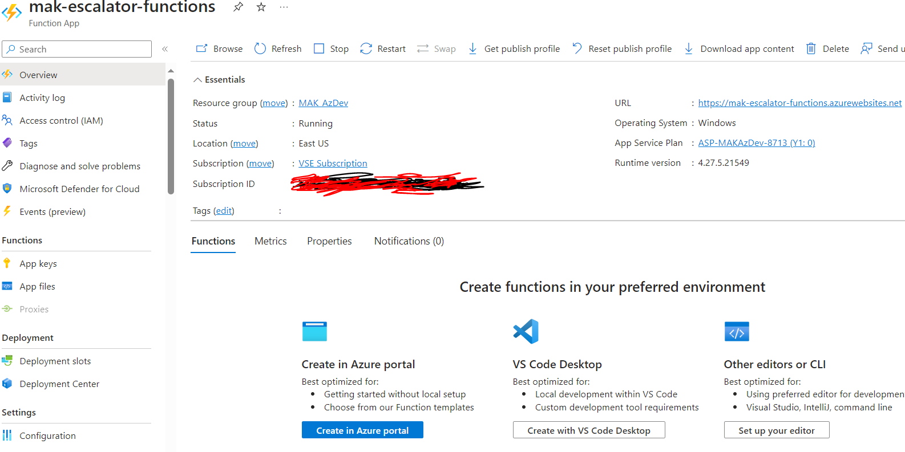
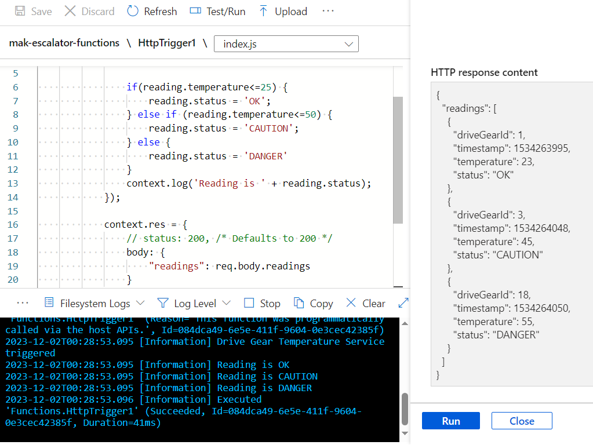

# Create serverless logic with Azure Functions
* Azure Functions allows developers to host business logic that can be executed without managing or provisioning infrastructure.

## Introduction
* An escalator company that has invested in IoT technology to monitor its product in the field. You oversee the processing of temperature sensor data from the drive gears of the escalators. You monitor the temperature data and add a data flag to indicate when the gears are too hot. In downstream systems, this data helps determine when maintenance is required.

* Company receives sensor data from several locations and from different escalator models. The data arrives in different formats, including batch file uploads, scheduled database pulls, messages on a queue, and incoming data from an event hub. Develop a reusable service that can process your temperature data from all these sources. Because elevator usage peaks at various times throughout the day and around the globe, the resources required for real-time processing vary throughout the day.

* Designing a service such as this with traditional enterprise architecture strategies, you would consider server infrastructure and maintenance up front. Then, you would scope out necessary hardware, plan to install it, coordinate with IT to manage it, and so on.

* Aternative is serverless computing. With serverless computing, your cloud provider manages the provisioning and maintenance of the infrastructure letting you focus completely on building the app logic. Azure Functions is a key component of the serverless computing offering from Azure and enables you to run pieces of code or functions, written in the programming language of your choice, in the cloud.

## Decide if serverless computing is right for your business needs
* [What is serverless compute?](https://azure.microsoft.com/en-us/solutions/serverless/)
    1. Serverless compute can be thought of as a <ins>function as a service (FaaS), or a microservice</ins> that is hosted on a cloud platform. 
    1. Business logic runs as functions and you don't have to manually provision or scale infrastructure. 
    1. The cloud provider manages infrastructure. Your app is automatically scaled out or down depending on load.

* What is Azure Functions? - It's a serverless application platform. 
    1. It enables developers to host business logic that can be executed without provisioning infrastructure. 
    1. Azure Functions provides intrinsic scalability and you're charged only for the resources used. 
    1. You can write your function code in the language. 
    1. Support for package managers like NuGet and npm is also included, so you can use popular libraries in your business logic.

* Benefits of a serverless compute solution
    1. Serverless compute is a great option for hosting business logic code in the cloud. 
    1. Write your business logic in the language of your choice. 
    1. Automatic scaling, you have no servers to manage, and you're charged based on what is used—not on reserved time. 
    1. Here are some other characteristics of a serverless solution for you to consider.
        1. Avoids over-allocation of infrastructure - Suppose you've provisioned VM servers and configured them with enough resources to handle your peak load times. When the load is light, you're potentially paying for infrastructure you're not using. Serverless computing helps solve the allocation problem by scaling up or down automatically, and you're only billed when your function is processing work.
        1. Stateless logic - Stateless functions are great candidates for serverless compute; function instances are created and destroyed on demand. If state is required, it can be stored in an associated storage service.
        1. Event driven - Functions are event driven. They run only in response to an event (called a "trigger"), such as receiving an HTTP request, or a message being added to a queue. You configure a trigger as part of the function definition. This approach simplifies your code by allowing you to declare where the data comes from (trigger/input binding) and where it goes (output binding). You don't need to write code to watch queues, blobs, hubs, and so on. You can focus purely on the business logic.
        1. Functions can be used in traditional compute environments - Functions are a key component of serverless computing, but they're also a general compute platform for executing any type of code. Should the needs of your app change, you can take your project and deploy it in a non serverless environment. That gives you the flexibility to manage scaling, run on virtual networks, and even completely isolate your functions.

* Drawbacks of a serverless compute solution
    1. Execution time - By default, functions have a timeout of five (5) minutes. This timeout is configurable to a maximum of 10 minutes. If your function requires more than 10 minutes to execute, you can host it on a VM. Additionally, if your service is initiated through an HTTP request and you expect that value as an HTTP response, the timeout is further restricted to 2.5 minutes. However, there's also an option called Durable Functions that lets you orchestrate the executions of multiple functions without any timeout.
    1. Execution frequency - If you expect clients to execute your function continuously, it would be prudent to estimate the usage and calculate the cost of using functions accordingly. It might be cheaper to host your service on a VM.
    1. When your function scales, only one function app instance can be created every 10 seconds, for up to 200 total instances. Keep in mind, each instance can service multiple concurrent executions, so there's no set limit about how much traffic a single instance can handle.

## Exercise - Create a function app in the Azure portal
* Implementing the temperature service by creating a function app to hold our Azure Function.

* What is a function app?
    1. Functions are hosted in an execution context called a function app. You define function apps to logically group and structure your functions and a compute resource in Azure. 
    1. Create a function app to host the escalator drive gear temperature service. 
    1. There are a few decisions that need to be made to create the function app; you need to choose a service plan and select a compatible storage account.

* Choose a service plan - Function apps may use one of the following hosting plans: Consumption plan, Premium plan, Dedicated (App service) plan
    1. <ins>Consumption plan</ins>
        1. When using the Azure serverless application platform, choose this one. 
        1. This plan provides automatic scaling and bills you only when your functions are running. 
        1. The Consumption plan comes with a configurable timeout period for executing a function. By default, it's five (5) minutes, but may be configured to have a timeout as long as 10 minutes.
    1. <ins>The Premium plan</ins> 
        1. It also dynamically scales your resources to meet demand, but you can specify a minimum number of VM instances to keep warm and reduce so called "cold starts." 
        1. The Premium plan also lets your functions connect to and run inside VMs. Like the Dedicated plan, the default timeout for apps in a Premium plan is 30 minutes, but they can essentially run for an unlimited time (depending on server availability).
    1. <ins>The Dedicated (App service) plan</ins> 
        1. It enables you to avoid timeout periods by having your function run continuously on a VM that you define. 
        1. An App service plan is technically <ins>not a serverless plan</ins>, because you're responsible for managing the app resources the function runs on. 
        1. However, it may be a better choice when you already have excess App Service resources available on which to also run your functions.

* Storage account requirements
    1. When you create a function app, it must be linked to a storage account. 
    1. The function app uses this storage account for internal operations, such as logging function executions and managing execution triggers. 
    1. On the Consumption plan, this storage account is also where the function code and configuration file are stored.

* Create a function app
    1. Create a resource -> Compute -> Function App -> Create
    1. Basics tab -> Enter Function App name (escalator-functions-xxx), Do you want to deploy code or container image? (Code), Runtime stack (Node.js), Version	Accept default, Operating system (Accept default), Hosting options and plans (Consumption (Serverless))
    1. Storage tab -> Storage account (create new or use existing) -> Create

* Verify your Azure function app -> Function App pane -> URL -> Open -> default Azure web page appears.

## Run your code on-demand with Azure Functions
* Triggers
    1. Functions are event driven, which means they run in response to an event. The type of event that starts a function is called a trigger. Each function must be configured with exactly one trigger.
    1. You can trigger function execution by using HTTP requests, a scheduled timer, and events from the following Azure services:

        | Azure Service	| Trigger description |
        |-- | -- |
        | Blob Storage	| Starts a function when a new or updated blob is detected. |
        | Azure Cosmos DB	| Start a function when inserts and updates are detected. |
        | Event Grid	| Starts a function when an event is received from Event Grid. |
        | Event Hubs	| Starts a function when an event is received from Event Hubs. |
        | Queue Storage	| Starts a function when a new item is received on a queue. The queue message is provided as input to the function. |
        | Service Bus	| Starts a function in response to messages from a Service Bus queue. |

* Bindings
    1. A binding is a declarative way to connect data and services to your function. 
    1. Bindings interact with various data sources, which means you don't have to write the code in your function to connect to data sources and manage connections. 
    1. The platform takes care of that complexity for you as part of the binding code. 
    1. Each binding has a <ins>direction</ins>: code reads data from <ins>input bindings</ins>, and writes data to output bindings. 
    1. Each function can have zero or more bindings to manage the input and output data processed by the function.
    1. A trigger is a type of input binding that has the ability to initiate execution of some code.
    1. Azure provides a large number of [bindings](https://learn.microsoft.com/en-us/azure/azure-functions/functions-triggers-bindings?tabs=isolated-process%2Cpython-v2&pivots=programming-language-csharp#supported-bindings) to connect to different storage and messaging services.

* Define a sample binding
    1. An example of configuring a function with an input binding (trigger) and an output binding. 
    1. Triggered when a message is added to a queue named myqueue-items. The return value written to outTable in Azure Table storage.
    1. Write a new row to Azure Table storage (output binding) whenever a new message appears in Azure Queue Storage (input binding). 
    1. The following snippet is the function.json file for this scenario.
        ```
            {
            "bindings": [
                {
                "name": "order",
                "type": "queueTrigger",
                "direction": "in",
                "queueName": "myqueue-items",
                "connection": "MY_STORAGE_ACCT_APP_SETTING"
                },
                {
                "name": "$return",
                "type": "table",
                "direction": "out",
                "tableName": "outTable",
                "connection": "MY_TABLE_STORAGE_ACCT_APP_SETTING"
                }
            ]
            }
        ```
    1. Could change the output to be an email using a SendGrid binding, or put an event onto a Service Bus to notify some other component
    1. Could even have multiple output bindings to push data to various services.
    1. View/edit function.json ->  Function app -> right side -> select JSON View
    1. Not all languages supported by Functions use the function.json file to define functions.

* Create a function in the Azure portal
    1. Azure Functions has predefined function templates, which are based on a specific type of trigger. These templates, make it easy to get started creating your first function.
    1. Portal-supported languages include: JavaScript, PowerShell, Python, and C# Script (.csx). 
    1. Nonportal supported languages include: C#, Java, Python (v2 programming model), and JavaScript/TypeScript (Node.js v4 programming model).

* Function templates
    1. Create 1st function in the portal, select a predefined trigger for your function. Based on your selections, Azure generates default code and configuration information, such as creating an event log entry when input data is received.
    1. Selecting a template from the Add function pane provides easy access to the most common development environments, triggers, and dependencies. 
    1. When you create a function in the Azure portal, you can choose from more than 20 templates. 
    1. Once created, you can further customize the code.

* Navigate to your function and its files
    1. Create a function from a template, several files are created, <ins>including a config file, function.json and a source code file, index.js</ins>.
    1. Can create or edit functions for your function app by selecting Functions under the Functions category from the Function App menu.
    1. Function App -> Function -> Code + Test -> actions (save, discard, obtain the published URL, ...). 
    1. Test/Run -> run use cases for requests that include query strings and values. 
    1. The function's path -> select a specific file from the dropdown to test or edit, for example, function.json.
    1. 
    1. Input tab -> build and test the function by adding query parameters and supplying values for your query string. 
    1. Output tab -> displays the results of the request.

* Test your Azure function
    1. After you've created a function in the portal, you'll want to test it. There are two approaches:
        1. Testing it in the portal - Previous image -> Run -> the results automatically appear in the Output tab, and the Logs pane opens to display the status.
    1. Running it manually - by triggering the configured trigger. For example, HTTP trigger (use a tool, Postman or cURL) use the function URL.

* Monitoring and Application Insights dashboard
    1. The ability to monitor your functions is critical during development and in production. 
    1. The Azure portal provides a monitoring dashboard, which you turn on by enabling Application Insights integration. 
    1. Function App -> Settings -> Application Insights -> Turn on -> Apply -> Yes. 
    1. The Application Insights dashboard provides a quick way to view the history of function operations by displaying the timestamp, result code, duration, and operation ID populated by Application Insights.
    1. 

* Streaming logs pane
    1. After you've enabled Application Insights in the Azure portal, you can add logging statements to your function for debugging. <ins>The called methods for each language are passed a "logging" object</isn>, which can be used to add log information to the Logs pane in the Code + Test pane when running a test.
    1. Write to logs from your code using the log method on the context object, which is passed to the handler. The following example writes to the default log level (information): <ins>context.log('Enter your logging statement here');</ins>

* Errors, failures, warnings, and anomalies
    1. You can use Metrics or options from the Investigate category in the Function menu to monitor performance, diagnose failures, or configure dozens of predefined workbooks to manage your function app. Everything from compilation errors and warnings in the code, to usage statistics by role.

## Exercise - Add logic to the function app   

* Function requirements - First, we need to define some requirements for our logic:
    1. Temperatures from 0 up to 25 degrees should be flagged as OK.
    1. Temperatures above 25 up to 50 degrees should be flagged as CAUTION.
    1. Temperatures above 50 degrees should be flagged as DANGER.

* Add a function to your function app
    1. Azure provides templates that help you build functions. Using the HttpTrigger template to implement the temperature service.
    1. 
    1. Function App -> Functions tab -> Create in Azure portal -> Create function -> HTTP trigger template -> Create -> The HttpTrigger1 is created and displays in the HttpTrigger1 Function pane.
    1. Code + Test -> index.js default code that the HTTP template generated appears in the following snippet.
        ```
            module.exports = async function (context, req) {
                context.log('JavaScript HTTP trigger function processed a request.');

                const name = (req.query.name || (req.body && req.body.name));
                const responseMessage = name
                    ? "Hello, " + name + ". This HTTP triggered function executed successfully."
                    : "This HTTP triggered function executed successfully. Pass a name on the query string or in the request body for a personalized response.";

                context.res = {
                    // status: 200, /* Defaults to 200 */
                    body: responseMessage
                };
            }
        ```
        1. Function expects a name to be passed in either through the query string, or the request body.
        1. The function responds by returning the message Hello, <name>. 
    1. function.json to view the configuration of the function.
        ```
        {
        "bindings": [
            {
            "authLevel": "function",
            "type": "httpTrigger",
            "direction": "in",
            "name": "req",
            "methods": [
                "get",
                "post"
            ]
            },
            {
            "type": "http",
            "direction": "out",
            "name": "res"
            }
        ]
        }
        ```
        1. This configuration file declares that the function runs when it receives an HTTP request. 
        1. The output binding declares that the response is sent as an HTTP response.

* Test the function
    1. Logs -> Select Filesystem Logs -> The log frame should start accruing trace notifications every minute.
    1. 
    1. Get function URL run by curl or Postman
    ```
        curl "<your-https-url>"

        Response : This HTTP triggered function executed successfully. Pass a name on the query string or in the request body for a personalized response.

        curl "<your-https-url>&name=Azure"

        Response : Hello, Azure. This HTTP triggered function executed successfully.
    ```

* Secure HTTP triggers
    1. HTTP triggers let you use API keys to block unknown callers by requiring a key as part of the request. 
    1. 
    1. When you create a function, you select the authorization level. 
        1. By default, it's set to Function, which requires a function-specific API key. 
        1. It can also be set to Admin to use a global "master" key, or Anonymous to indicate that no key is required. 
        1. You can also change the authorization level through the function properties after creation.
    1. Supply the key through a query string parameter (code) Or an HTTP header (x-functions-key).
    1. HttpTrigger1 function -> Function Keys -> Get the key
    1. Test the function with the function key
    ```
    curl --header "Content-Type: application/json" --header "x-functions-key: <your-function-key>" --request POST --data "{\"name\": \"Azure Function\"}" <your-https-url>
    ```
    1. Code + Test -> Check the logs.

* Add business logic to the function
    1. Check temperature readings that it receives, and set a status for each temperature reading.
    1. Our function is expecting an array of temperature readings. The JSON of the request body. Each reading entry has an ID, timestamp, and temperature.
    ```
        {
            "readings": [
                {
                    "driveGearId": 1,
                    "timestamp": 1534263995,
                    "temperature": 23
                },
                {
                    "driveGearId": 3,
                    "timestamp": 1534264048,
                    "temperature": 45
                },
                {
                    "driveGearId": 18,
                    "timestamp": 1534264050,
                    "temperature": 55
                }
            ]
        }
    ```
    1. Implement business logic in index.js file -> Save
    ```    
    module.exports = function (context, req) {
        context.log('Drive Gear Temperature Service triggered');
        if (req.body && req.body.readings) {
            req.body.readings.forEach(function(reading) {

                if(reading.temperature<=25) {
                    reading.status = 'OK';
                } else if (reading.temperature<=50) {
                    reading.status = 'CAUTION';
                } else {
                    reading.status = 'DANGER'
                }
                context.log('Reading is ' + reading.status);
            });

            context.res = {
                // status: 200, /* Defaults to 200 */
                body: {
                    "readings": req.body.readings
                }
            };
        }
        else {
            context.res = {
                status: 400,
                body: "Please send an array of readings in the request body"
            };
        }
        context.done();
    };
    ```

* Test our business logic
    1. Test/Run -> Input tab -> Body -> add the above array json for sample request -> Select Run. 
    1. 
    1. To see log messages, open the Logs tab in the bottom flyout of the pane
    1. The Output tab shows that a status field has been correctly added to each of the readings.
    1. 
    1. Monitor -> see that the request has been logged to Application Insights. 
        1. if not, Function App -> Application Insights -> Turn on -> New resource name field  (select your function app) -> Location field (select the region you initially associated with your function app.) -> Apply -> Yes.      
* Check your knowledge
    1. Which of the following best defines serverless logic? 
        1. [ ] Code you write that doesn't run on servers.
        1. [ ] Code you write that runs on servers you manage.
        1. [x] Code you write that runs on servers a cloud provider manages.
    2. The container that groups functions into a logical unit for easier management, deployment, and sharing of resources is called? 
        1. [ ] Resource group
        1. [x] Function app
            1. A function app is a way to organize one or more individual functions and collectively manage them with Azure App Service. All the functions in a function app, share the same pricing plan, continuous deployment, and runtime version.
        1. [ ] Function collection
    3. We secured our function against unknown HTTP callers by requiring a function-specific API key be passed with each call. Which of the following fields is the header name in the HTTP requests that needs to contain this key? 
        1. [x] x-functions-key
        1. [ ] x-requested-with
        1. [ ] x-csrf-token         