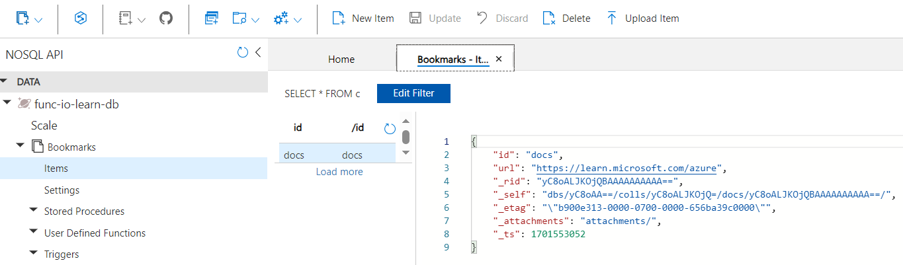

# Chain Azure Functions together using input and output bindings

## Introduction
* Suppose you run a social networking site for professionals. You're allowing your users to upload their headshot images to be posted on their profile. 
* To reduce the workload on the web server, you want to create a serverless back end using Azure Functions to process this data.
* You want to create an image thumbnail and then save it to permanent storage.

## Explore input and output binding types
* Accessing and processing data are key tasks in many software solutions. Consider some of these scenarios:
    1. You've been asked to implement a way to move incoming data from Azure Blob Storage to Azure Cosmos DB.
    1. You want to post incoming messages to a queue for processing by another component in your enterprise.
    1. Your service needs to grab gamer scores from a queue and update an online scoreboard.
* All of these examples are about moving data. The data source and destinations differ from scenario to scenario, but the pattern is similar. 
* connect to a data source, and you read and write data. Azure Functions helps you integrate with data and services by using bindings.

* What is a binding?
    1. In Azure Functions, bindings provide a declarative way to connect to data from within your code. They make it easier to integrate with data streams consistently in a function. 
    1. can have multiple bindings providing access to different data elements. This integration is powerful because you can connect to your data sources without having to code specific connection logic (like database connections or web API interfaces).

* Types of bindings - There are two kinds of bindings you can use with functions:
    1. Input binding - Connects to a data source. Our function can read data from these input sources.
    1. Output binding - Connects to a data destination. Our function can write data to these output destinations.
    1. There are also triggers, which are special types of input bindings that cause a function to run. For example, an Azure Event Grid notification can be configured as a trigger. When an event occurs, the function runs.

* Types of supported bindings
    1. The type of binding defines where we're reading or sending data. There's a binding to respond to web requests, and a large selection of bindings to interact directly with various Azure services and third-party services.
    1. A binding type can be used as an input, an output, or both. For example, a function can write to a Blob Storage output binding, but a Blob Storage update could trigger another function.
    1. Common binding types include: Blob Storage, Azure Service Bus Queues, Azure Cosmos DB, Azure Event Hubs, External files, External tables, HTTP endpoints

* Binding properties - 3 properties are required in all bindings, might have to supply more properties based on the type of binding and storage you're using.
    1. Name - Defines the function parameter through which you access the data. For example, in a queue input binding, this property is the name of the function parameter that receives the queue message content.
    1. Type - Identifies the type of binding. For example, the type of data or service you want to interact with.
    1. Direction - Indicates the direction data is flowing. For example, is it an input or output binding?
    1. Additionally, most binding types also need a fourth property:
        1. Connection - Provides the name of an app setting key that contains the connection string. Bindings use connection strings stored in app settings to keep secrets out of the function code. Connection strings make your code more configurable and secure.

* Create a binding
    1. Bindings are defined in JSON. A binding is configured in your function's configuration file (function.json) and lives in the same folder as your function code.
    1. Let's examine a sample input binding:
    ```
        {
        "name": "headshotBlob",
        "type": "blob",
        "path": "thumbnail-images/{filename}",
        "connection": "HeadshotStorageConnection",
        "direction": "in"
        },
    ```
    1. To create this binding, we:
        1. Create a binding in our function.json file.
        1. Provide the value for the name variable. In this example, the variable holds the blob data.
        1. Provide the storage type. In the preceding example, we're using Blob Storage.
        1. Provide the path, which specifies the container and the item name that goes in it. 
            1. The path property is required when using the blob trigger, with curly braces around the filename portion of the path. 
            1. This syntax creates a binding expression that allows you to reference the blob's name in other bindings, and in your function's code. 
            1. In this example, a parameter on the function named filename would be populated with the filename of the blob that triggered the function.
        1. Provide the connection string setting name defined in the application's settings file. It's used as a key to find the connection string to connect to your storage account.
        1. Define the direction as in. It reads data from the blob.
    1. Bindings are used to connect to data in your function. In this example, we used an input binding to connect user images for processing by our function as thumbnails.

## Exercise - Explore input and output binding types
* create a function that runs when it receives an HTTP request, and responds to each request by returning a message.
* 
* The parameter req is the trigger binding, and the parameter res is the output binding. 

* Create a function app (Code, Node.js) - A function app lets you group functions as a logical unit for easier management, deployment, and sharing of resources.

* Create a HTTP trigger function -> Authorization level (default value Function) -> Get Function Url -> Run wiht name query string
    1. Authorization level determines what keys need to be present on the request in order for it to run. 
    1. Function authorization level requires a function-specific key, which we can find once it's created.
    1. Must define a trigger when you create a function. Each function has a single trigger. 
    1. In this example, function starts when it receives an HTTP request. 
    1. If no query string was provided, the function responds with a message that asks whomever is calling to supply a name value.

* Explore binding types
    1. Function -> select Integration -> Already defined a trigger and an output binding
    1. 
    1. can't add more than one trigger. To change a trigger for a function, you need to delete the trigger and create a new one.
    1. the Inputs and Outputs sections enable you to add more than one binding, so the request can accept more than one input value and return more than one output value.
    1. Inputs box -> select Add input -> Binding Type (view a list of all possible input binding types).
    1. 
    1. Outputs box -> Add output -> Binding Type (view a list of all possible output binding types).
    1. 

## Read data with input bindings
* To connect to a data source, need to configure an input binding. 
* An input binding makes it possible to write minimal code to create a message. 
* No need to write code for tasks, such as opening a storage connection; the Azure Functions runtime and binding take care of those tasks for you.

* Input binding types
    1. Azure chain functions can have multiple types of input. However, not all types support both input and output. 
    1. Use an input function whenever you want to ingest data of that type. 
    1. [Here, we look at the input function types that support input bindings and when to use them.
        1. Azure Blob Storage - bindings allow you to read from a blob](https://learn.microsoft.com/en-us/azure/azure-functions/functions-triggers-bindings?tabs=isolated-process%2Cpython-v2&pivots=programming-language-csharp#supported-bindings).
        1. Azure Cosmos DB - bindings use the SQL API to retrieve one or more Azure Cosmos DB documents, and pass them to the input parameter of the function. The document ID, or query parameters, can be determined based on the trigger that invokes the function.
        1. Mobile Apps - binding loads a record from a mobile table endpoint and passes it into your function.
        1. Azure Table storage - can read data and work with Azure Table storage.
    1. To create a binding as an input, you must define direction as in. The parameters for each type of binding might vary.

* What is a binding expression?
    1. A binding expression is specialized text in function.json, function parameters, or code that is evaluated when the function is invoked, to yield a value. 
    1. For example, if you have a Service Bus Queue binding, you could use a binding expression to obtain the name of the queue from App Settings.
    1. Types of binding expressions: App settings, Trigger filename, Trigger metadata, JSON payloads, New GUID, Current date and time
    1. Most binding expressions are identified by being wrapped in curly braces. 
    1. However, app setting binding expressions are wrapped in percent signs, rather than curly braces. 
    1. For example, if the blob output binding path is %Environment%/newblob.txt, and the Environment app setting value is Development, a blob is created in the Development container.

* Summary
    1. Input bindings allow you to connect your function to a data source. 
    1. can connect to several types of data sources, and the parameters for each vary. 
    1. To resolve values from input sources, use binding expressions in the function.json file, in function parameters, or in code.

## Read data with input bindings
* create a bookmark lookup service. Initially, your service is read-only. If users want to find an entry, they send a request with the ID of the entry, and our function returns the URL. The following flowchart illustrates the logical flow.


* When a user sends a request with text, the find bookmark function tries to find an entry in your database that contains a bookmark with the text as a key or ID. The system returns a result that indicates whether you found the entry.

* When the Azure function receives a request with a bookmark ID, it first checks whether the request is valid. If it isn't, an error response is generated. 
* If the request is valid, the function checks whether the bookmark ID exists in the Azure Cosmos DB database. If it doesn't exist, an error response is generated. If the bookmark ID is found, a success response is generated.

* Store the data in an Azure Cosmos DB instance.

* Create an Azure Cosmos DB account -> Search Azure Cosmos DB -> Select Azure Cosmos DB for NoSQL -> Create -> Accept the default values

* Add a container
    1. In an Azure Cosmos DB, a container is used to store various user-generated entities, also called items. create a container called Bookmarks.
    1.  
    1. Azure Cosmos DB -> Data Explorer -> New Container -> Accept the defaults -> Ok
    1. Enter the setting value -> Database id (func-io-learn-db), Database Max RU/s (4000), Container id (Bookmarks), Partition key (/id)
        1. the default throughput of 4000 request units per second (RU/s). To reduce latency, you can scale up the performance later.	
        1. The partition key specifies how the documents in Azure Cosmos DB collections are distributed across logical data partitions. 
        1. Use the Partition key setting as a convenience here because not concerned with database performance
         in this module. To learn more about Azure Cosmos DB partition key strategies, explore the Microsoft Learn Azure Cosmos DB modules.
    1. When complete, the Data Explorer displays func-io-learn-db in DATA under NOSQL API.
        1. Select func-io-learn-db to expand it, it contains several child members, including Scale and Bookmarks.
        1. Expand the Bookmarks container, and notice that it's prepopulated with several child members.
    1. 

* Add test data -> select Items -> select New Item -> Add the JSON code > Save.
    ```
    {
        "id": "docs",
        "url": "https://learn.microsoft.com/azure"
    }
    ```

* if a request arrives with "id=docs", it looks up that ID in your Bookmarks container, and returns the URL https://learn.microsoft.com/azure. 
* More properties added. They all begin with an underline (_rid, _self, _etag, _attachments, _ts). These are system generated to help manage the items that you add to the container.

    | Property	| Description |
    | -- | -- |
    | _rid	| Resource ID is a unique identifier that is also hierarchical per the resource stack on the resource model. It's used internally for placement and navigation of the item resource. |
    | _self	| nique addressable URI for the resource. |
    | _etag	| Required for optimistic concurrency control. |
    | _attachments	| Addressable path for the attachments resource. |
    | _ts	| Timestamp of the last update of this resource. |

* Add more items
    ```
        {
            "id": "portal",
            "url": "https://portal.azure.com"
        }
        {
            "id": "learn",
            "url": "https://learn.microsoft.com/training"
        }
        {
            "id": "marketplace",
            "url": "https://azuremarketplace.microsoft.com/marketplace/apps"
        }
        {
            "id": "blog",
            "url": "https://azure.microsoft.com/blog"
        }
    ```
* Create your function
    1. Go to Function App -> HttpTrigger1 -> Create another HTTP trigger (HttpTrigger2) with default settings.
    1. Verify the function Url by pass with &name=<you name>.
    
* Add an Azure Cosmos DB input binding
    1. To read data from the database, you need to define an input binding. 
    1. HttpTrigger2 Function -> Integration -> Inputs box -> Add input -> Binding Type (select Azure Cosmos DB).
    1. under the Cosmos DB account connection setting -> select New -> By default, the Cosmos DB account you created earlier -> Ok
        1. If a message appears prompting you to install the Microsoft.Azure.WebJobs.Extensions.CosmosDB extension, select Install and wait for it to finish.
    1. Complete the other settings

        | Setting	| Value	| Description
        | -- | --| --| 
        | Document parameter name	| bookmark	| The name used to identify this binding in your code.
        | Database name	| func-io-learn-db	| The database to work with. This value is the database name we set.
        | Collection Name	| Bookmarks	| The collection we read the data from. This setting was defined.
        | Document ID	| id	| Add the Document ID that we defined when we created the Bookmarks Azure Cosmos DB container.
        | Partition key	| /id	| Add the partition key that you defined when you created the Bookmarks Azure Cosmos DB collection. The key entered here (specified in input binding format <key>) must match the one in the collection.
        | SQL Query (optional)	| Leave blank	| You're only retrieving one document at a time based on the ID. So, filtering with the Document ID setting is a better than using a SQL Query in this instance. You could craft a SQL Query to return one entry (SELECT * from b where b.ID = id). That query would indeed return a document, but it would return it in a document collection. Your code would have to manipulate a collection unnecessarily. Use the SQL Query approach when you want to get multiple documents.

    1. To clarify these settings, look up a bookmark with a specific ID, tied the Document ID that our function receives in the query string to the input binding. This syntax is known as a <ins>binding expression</ins>.
    1. The function is triggered by an HTTP request that uses a query string to specify the ID to look up. Because IDs are unique in our collection, the binding returns either 0 (not found) or 1 (found) documents.
    1. Save
    
* Update the function implementation
    1. Make two changes to implement the binding that you created:
        1. Modify your function's language-specific implementation code. It needs to determine whether a document was found in the database that matches the ID that is passed to the function.
        1. Modify your function's JSON implementation code to accept a parameter that is passed in the query string.

* Modify HttpTrigger2 function's JavaScript implementation code -> Code + Test -> Replace index.js code -> Save -> Filesystem Logs
    ```
    module.exports = function (context, req) {

        var bookmark = context.bindings.bookmark

        if(bookmark){
            context.res = {
            body: { "url": bookmark.url },
            headers: {
                'Content-Type': 'application/json'
            }
            };
        }
        else {
            context.res = {
                status: 404,
                body : "No bookmarks found",
                headers: {
                'Content-Type': 'application/json'
                }
            };
        }

        context.done();
    };
    ```
    1. Save -> Select Filesystem Logs
    1. Examine the code
        1. An incoming HTTP request triggers the function, and an id query parameter is passed to the Azure Cosmos DB input binding.
        1. If the database finds a document that matches this ID, the bookmark parameter is set to the located document.
        1. In this example, the code constructs a response that contains the URL value that is found in the corresponding document of the database.
        1. If no document is found matching this key, the request would respond with a payload and status code that tells the user the bad news.

* Modify HttpTrigger2 function's JSON implementation code -> Select function.json -> Replace code -> Save
    1. Modify the values for id and partitionKey so that they accept a parameter of {id}.
    ```
    {
    "bindings": [
        {
        "authLevel": "function",
        "type": "httpTrigger",
        "direction": "in",
        "name": "req",
        "methods": [
            "get",
            "post"
        ]
        },
        {
        "type": "http",
        "direction": "out",
        "name": "res"
        },
        {
        "name": "bookmark",
        "direction": "in",
        "type": "cosmosDB",
        "connection": "your-database_DOCUMENTDB",
        "databaseName": "func-io-learn-db",
        "containerName": "Bookmarks",
        "id": "{id}",
        "partitionKey": "{id}"
        }
    ]
    }
    ```

* Try it out
    1. Get function URL, like https://example.azurewebsites.net/api/HttpTrigger2?code=AbCdEfGhIjKlMnOpQrStUvWxYz==&id=docs
    1. Replace &id=docs with &id=missing, press Enter, and observe the response. 
    1. Error => Executed 'Functions.HttpTrigger2' (Failed, Id=629c2089-3d74-462b-9f1b-b47d82178687, Duration=4ms)Cosmos DB connection configuration 'CosmosDB' does not exist. Make sure that it is a defined App Setting.
    ```
    {
      "connectionStringSetting": "mak-cosmos-db-nosql_DOCUMENTDB",
      "name": "bookmark",
      "databaseName": "func-io-learn-db",
      "collectionName": "Bookmarks",
      "id": "id",
      "partitionKey": "/id",
      "direction": "in",
      "type": "cosmosDB"
    },

    change to 

    {
      "name": "bookmark",
      "direction": "in",
      "type": "cosmosDB",
      "connection": "my-database_DOCUMENTDB",
      "databaseName": "func-io-learn-db",
      "containerName": "Bookmarks",
      "id": "{id}",
      "partitionKey": "{id}"
    }
    ```
    [Solution](https://learn.microsoft.com/en-us/answers/questions/1350920/what-should-i-do-about-the-azure-function-http-tri)

## Write data with output bindings
* Multiple types of output bindings. However, not all types of bindings support both input and output. Output binding types
    1. Blob Storage - You can use the blob output binding to write blobs.
    1. Azure Cosmos DB - The Azure Cosmos DB output binding lets you write a new document to an Azure Cosmos DB database using the SQL API.
    1. Event Hubs - The Event Hubs output binding let's you write events to an event stream. To write events to an event hub, you must have send permission.
    1. HTTP - Use the HTTP output binding to respond to the HTTP request sender. This binding requires an HTTP trigger and allows you to customize the response associated with the trigger's request. It can also be used to connect to webhooks.
    1. Microsoft Graph - Microsoft Graph output bindings allow you to write to files in OneDrive, modify Excel data, and send email through Outlook.
    1. Mobile Apps - The Mobile Apps output binding writes a new record to a Mobile Apps table.
    1. Notification Hubs - You can send push notifications with Notification Hubs output bindings.
    1. Queue Storage - Use the Azure Queue Storage output binding to write messages to a queue.
    1. Send Grid - Send emails using SendGrid bindings.
    1. Service Bus - Use an Azure Service Bus output binding to send queue or topic messages.
    1. Table Storage - Use an Azure Table Storage output binding to write to a table in an Azure Storage account.
    1. Twilio - Send text messages with Twilio.

* To create a binding as an output, you must define the direction as out. The parameters for each type of binding might vary.

* It's possible to apply multiple bindings to a single function, allowing you to define both input and output bindings. The input and output bindings can even be the same binding type.

## Exercise - Write data with output bindings
* scenario to include writing. Consider the following flowchart:

    1. receive requests to add bookmarks to our collection. The requests pass in the desired key, or ID, along with the bookmark URL. Respond with an error if the key already exists in our back end.

    1. If the key that was passed to us isn't found, we add the new bookmark to our database. 

    1. Another scenario - send the new bookmark to a QR code generation service? That service would, generate a QR code for the URL, store the image in Blob Storage, and add the address of the QR image into the entry in our bookmarks collection.

* Create an HTTP-triggered function
    1. Create HttpTrigger3 function -> Add an Azure Cosmos DB input binding -> Pass the above same setting -> Ok
        1. Doc para name (bookmark), Db name (func-io-learn-db), Col Name (Bookmarks), Doc ID ({id}), Part key	({id})
    1. Add output -> Azure Cosmos DB -> Add same setting -> Ok
        1. Doc para name (newbookmark), Db name (func-io-learn-db), Col Name (Bookmarks), Partition key	(/id)

* Add an Azure Queue Storage output binding
    1. Azure Queue storage is a service for storing messages that can be accessed from anywhere in the world. 
    1. The size of a single message can be as much as 64 KB, and a queue can contain millions of messages--up to the total capacity of the storage account in which it's defined. 
    1. The following diagram shows, at a high level, how a queue is used in our scenario.
    1. 
        1. a function named add-bookmark adds messages to a queue, and another named gen-qr-code pops messages from the same queue, and processes the request. 
        1. Because we write, or push, messages to the queue from add-bookmark, we add a new output binding to your solution.
    1. create the binding
        1. Add output -> Azure Queue Storage -> Storage account connection (select exist one) - Ok
            1. Message parameter name (newmessage) - The binding property we use in code.
            1. Queue name (bookmarks-post-process) - The name of the queue where we're placing bookmarks so that another function can process them further.
* Update function implementation
    1. HttpTrigger3 index.js , replace code
            ```
            module.exports = function (context, req) {

                var bookmark = context.bindings.bookmark;
                if(bookmark){
                        context.res = {
                        status: 422,
                        body : "Bookmark already exists.",
                        headers: {
                        'Content-Type': 'application/json'
                        }
                    };
                }
                else {
                    
                    // Create a JSON string of our bookmark.
                    var bookmarkString = JSON.stringify({ 
                        id: req.body.id,
                        url: req.body.url
                    });

                    // Write this bookmark to our database.
                    context.bindings.newbookmark = bookmarkString;

                    // Push this bookmark onto our queue for further processing.
                    context.bindings.newmessage = bookmarkString;

                    // Tell the user all is well.
                    context.res = {
                        status: 200,
                        body : "bookmark added!",
                        headers: {
                        'Content-Type': 'application/json'
                        }
                    };
                }
                context.done();
            };
            ```
    1. Let's break down what this code does:
        1. the HTTP request to be a POST, and the bookmark data to be part of the request body.
        1. Azure Cosmos DB input binding attempts to retrieve a document, or bookmark, by using the id that we receive. If it finds an entry, the bookmark object is set. The if(bookmark) condition checks to see whether an entry was found.
Adding to the database is as simple as setting the context.bindings.newbookmark binding parameter to the new bookmark entry, which we've created as a JSON string.
Posting a message to our queue is as simple as setting the context.bindings.newmessage parameter.
 Note

The only task you performed was to create a queue binding. You never created the queue explicitly. You are witnessing the power of bindings! As the following notification declares, the queue is automatically created for you if it doesn't exist.

Screenshot showing message that the queue will be auto-created. .

So, that's it. Let's see our work in action in the next section.

Try it out
Now that we have multiple output bindings, testing becomes a little trickier. In previous units, we were content to test by sending an HTTP request with a query string, but we want to perform an HTTP post this time. We also need to check to see whether messages are making it into a queue.

In command bar of the Code + Test pane for your HttpTrigger3 function, select Test/Run. A new pane appears, with the Input tab open, as shown in this image:

Screenshot showing the test/run pane.

In the HTTP method dropdown list, verify that POST is selected.

Replace the contents of the request Body with the following JSON object:

JSON

Copy
{
    "id": "docs",
    "url": "https://learn.microsoft.com/azure"
}
Select Run.

The programmatic progress shows in the Logs pane. When completed, verify that the Output tab displays "Bookmark already exists." in the HTTP response content setting.

Screenshot of output tab showing bookmark already exists response.

You added the bookmark item in Exercise - Read data with input bindings. The response confirms that your var bookmark = context.bindings.bookmark JavaScript is working correctly, and that your PowerShell code is making the same connection.

Let's post a second bookmark to the database. Select the Input tab.

Replace the contents of the request Body with the following JSON object:

JSON

Copy
{
    "id": "github",
    "url": "https://www.github.com"
}
Select Run.

Verify that the Output tab displays "bookmark added!" in the HTTP response content, as shown in the following screenshot.

Screenshot of output tab showing bookmark added response.

Congratulations! Your function works as designed! But, what about the queue operation we added to the code? Well, let's go see whether something was written to a queue.

Verify that a message is written to the queue
Azure Queue Storage queues are hosted in a storage account. You configured the storage account when you created the output binding.

In the Azure portal global search bar, enter storage accounts, and then in the results list, select Storage accounts. The Storage accounts pane appears.

Screenshot showing search results for Storage Account search.

Select the storage account that you used to configure the newmessage output binding.

In the Storage account menu, under Data storage, select Queues to list the queues hosted by this storage account. Verify that the bookmarks-post-process queue is listed, as shown in the following screenshot.

Screenshot showing queues hosted by this storage account.

Select bookmarks-post-process to list the messages that are in the queue. If all went according to plan, the queue includes the message that you posted when you added a bookmark to the database. It should look like the following.

Screenshot of message queue with two messages.

In this example, the message was given a unique ID, and the Message text column displays your bookmark in JSON format. There's no message for the Azure docs bookmark that you tried to add because it already existed in the database.

You can test the function further by changing the request body in the test pane with new id/url sets, and running the function. Watch this queue to see more messages arrive. You can also look at the database to verify that new entries have been added.

In this exercise, we expanded your knowledge of bindings to output bindings, and writing data to your Azure Cosmos DB. We added an output binding to post messages to an Azure queue. This example demonstrates the true power of bindings to help you shape and move data from incoming sources to various destinations. We haven't written any database code or had to manage connection strings ourselves. Instead, we configured bindings declaratively, and let the platform take care of securing connections, scaling our function, and scaling our connections.