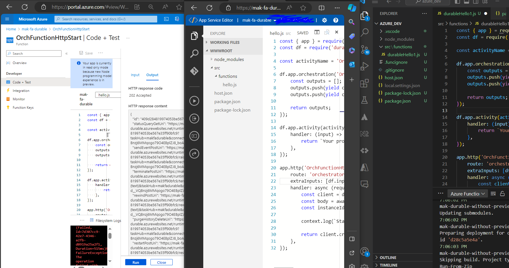
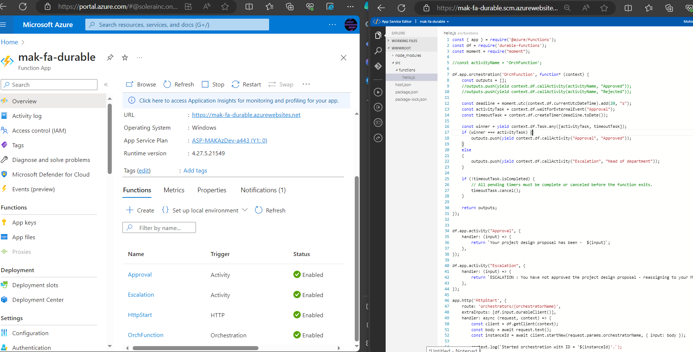

# Create a long-running serverless workflow with Durable Functions

## Introduction
* Durable Functions is an extension of Azure Functions that lets you perform long-lasting, stateful operations in Azure. 
* Azure provides the infrastructure for maintaining state information. You can use Durable Functions to orchestrate a long-running workflow. 
* Using this approach, you get all the benefits of a serverless hosting model while letting the Durable Functions framework take care of activity monitoring, synchronization, and runtime concerns.

## What is Durable Functions?
* Durable Functions allows you to implement complex stateful functions in a serverless-environment.

* scenario, company follows a manual approval process for project-design proposals. The process has multiple steps, and each step in the process can vary in duration. Implementing an automated process in-house is complex and costly. Coordinating each step takes effort. In addition, you must be able to incorporate custom logic into the workflow.

* Durable functions 
    1. Durable Functions is an extension of Azure Functions. Whereas Azure Functions operates in a stateless environment, Durable Functions can retain state between function calls. This approach allows you to simplify complex stateful executions in a serverless environment.
    1. Durable Functions scales as needed and provides a cost-effective means of implementing complex workflows in the cloud. 
    1. Some benefits of using Durable Functions include:
        1. They enable you to write event driven code. A durable function can wait asynchronously for one or more external events, then perform a series of tasks in response to these events.
        1. You can chain functions together. You can implement common patterns such as fan-out/fan-in, which uses one function to invoke others in parallel, then accumulate the results.
        1. You can orchestrate and coordinate functions and specify the order in which functions should execute.
        1. The state is managed for you. You don't have to write your own code to save state information for a long-running function.
    1. Durable Functions allows you to define stateful workflows using an orchestration function. An orchestration function provides these extra benefits:
        1. You can define the workflows in code. You don't need to write a JSON description or use a workflow design tool.
        1. Functions can be called both synchronously and asynchronously. Output from the called functions is saved locally in variables and used in subsequent function calls.
        1. Azure checkpoints the progress of a function automatically when the function awaits. Azure might choose to dehydrate the function and save its state while the function waits to preserve resources and reduce costs. When the function starts running again, Azure will rehydrate it and restore its state.

* Function types - 3 durable function types: Client, Orchestrator, and Activity.
    1. Client functions are the entry point for creating an instance of a Durable Functions orchestration. They can run in response to an event from many sources, such as a new HTTP request arriving, a message being posted to a message queue, an event arriving in an event stream. You can write them in any of the supported languages.
    1. Orchestrator functions describe how actions are executed and the order in which they're run. You write the orchestration logic in code (C# or JavaScript).
    1. Activity functions are the basic units of work in a Durable Functions orchestration. An activity function contains the actual work performed by the tasks being orchestrated.

* Application patterns -Use Durable Functions to implement many common workflow patterns. These patterns include:
    1. Function chaining: the workflow executes a sequence of functions in a specified order. One function's output is applied to the next function's input in the sequence. The final function's output is used to generate a result.
    1. 
    1. Fan out/fan in: runs multiple functions in parallel and waits for all the functions to finish. You can aggregate the results of the parallel executions or use them to compute a final result.
    1. 
    1. Async HTTP APIs: addresses the problem of coordinating state of long-running operations with external clients. An HTTP call can trigger the long-running action, then redirect the client to a status endpoint. The client can learn when the operation is finished by polling this endpoint.
    1. 
    1. Monitor: implements a recurring process in a workflow, possibly looking for a change in state. For example, you could use this pattern to poll until specific conditions are met.
    1. 
    1. Human interaction: combines automated processes that also involve some human interaction. A manual process within an automated process is tricky because people aren't as highly available and as responsive as most computers. You can incorporate human interaction using timeouts and compensation logic that runs if the human fails to interact correctly within a specified response time. An approval process is an example of a process that involves human interaction.
    1. 

* Comparison with Logic Apps
    1. Durable Functions and Logic Apps are both Azure services that enable serverless workload. 
    1. Azure Durable Functions is intended as a powerful serverless compute option to run custom logic. 
    1. Azure Logic Apps is better suited for integrating Azure services and components. 
    1. Use either technology to create complex orchestrations. 
    1. With Azure Durable Functions, you develop orchestrations by writing code and using the Durable Functions extension. 
    1. With Logic Apps, you create orchestrations by using the design surface or editing configuration files.
    1. key differences between Azure Durable Functions and Azure Logic Apps.

| Task	| Azure Durable Functions	| Azure Logic Apps
| --| --| --| 
| Development	| Code-first (imperative)	| Design-first (declarative)
| Connectivity	| About a dozen built-in binding types. You can write code for custom bindings.	| Large collection of connectors. Enterprise Integration Pack for B2B. You can also build custom connectors.
| Actions	| Each activity is an Azure Function. You write the code for activity functions.	| Large collection of ready-made actions. You integrate custom logic through custom connectors.
| Monitoring	| Azure Application Insights	| Azure portal, Azure Monitor logs
| Management	| REST API, PowerShell, Visual Studio	Azure portal, | REST API, PowerShell, Visual Studio, Visual Studio Code extension

## Design a workflow based on Durable Functions

* Description of the design approval process
    1. Our workflow begins when a project design is submitted for approval. 
    1. The proposal is assigned as an approval task to a manager. 
    1. The manager will either approve or reject the proposal. 
    1. In the real world, this event would probably generate and send a notification to the proposal author to let them know the approve/reject request outcome. 
    1. In this example, you'll just change the status of the task to either approved or rejected.
    1. The workflow steps are as follows:
        1. A project design is submitted.
        1. An approval task is allocated to a manager so they can review the project design proposal.
        1. The project design proposal is rejected or approved.
        1. An escalation task is allocated if the approval task isn't completed within a pre-defined time limit.
    1. The following image is a visual representation of workflow showing the three functions in our orchestration: the request approval, the process approval and an escalate function.
    1. 
    1. The following table shows how the workflow steps can be mapped to the function types we use in a Durable Functions workflow.
        | Workflow function	| Durable Function Type |
        | --| --|
        | Submitting a project design proposal for approval	| Client Function |
        | Assign an Approval task to relevant member of staff	| Orchestration Function |
        | Approval task	| Activity Function |
        | Escalation task	| Activity Function |
    1. The Orchestration function will manage a rule in the workflow that starts the escalation activity if the approval activity doesn't return within a specified time.

## Exercise - Create a workflow using Durable Functions
* Learn how to create an approval workflow using Durable Functions.

* Create a Function App -> Code, Node.js, Windows, Consumption (Serverless), Storage, Monitoring (Enable Application Insights (No)).

* Install the durable-functions npm package
    1. creating JavaScript Durable Functions, need to install the durable-functions npm package. 
    1. Function App -> under Development Tools -> App Service Editor (preview) -> Open editor -> Higlight WWWROOT folder -> Open Console icon.
        1. use this console to access the web server that hosts your functions and write the code for your functions.
        1. Create a new package.json file. Run the cmds
            ```
            touch package.json
            open package.json
            ```
        1. Add the following code.
            ```
            {
            "name": "example",
            "version": "1.0.0"
            }
            ```
        1. Replace "example", like use the globally unique name that you specified for your function earlier.
        1. Select Ctrl+S to save the file, then Ctrl+Q to close the document.
    1. Back to Function App -> under Development Tools -> Console -> Run "npm install durable-functions" -> Ignore warnings
    1. Overview -> Restart
    
* Create the client function for submitting a design proposal
    1. Function App -> Durable Functions HTTP starter template -> New Function (HttpStart), Authorization (Function) -> index.js
        ```
        const df = require("durable-functions");

        module.exports = async function (context, req) {
            const client = df.getClient(context);
            const instanceId = await client.startNew(req.params.functionName, undefined, req.body);

            context.log(`Started orchestration with ID = '${instanceId}'.`);

            return client.createCheckStatusResponse(context.bindingData.req, instanceId);
        };
        ```
    1. function.json
        ```
        {
        "bindings": [
            {
            "authLevel": "function",
            "name": "req",
            "type": "httpTrigger",
            "direction": "in",
            "route": "orchestrators/{functionName}",
            "methods": [
                "post",
                "get"
            ]
            },
            {
            "name": "$return",
            "type": "http",
            "direction": "out"
            },
            {
            "name": "starter",
            "type": "orchestrationClient",
            "direction": "in"
            }
        ]
        }
        ```
* Create the orchestrator function
    1. Function App -> Durable Functions orchestrator template -> Function (OrchFunction) -> Create -> index.js
        ```
        const df = require("durable-functions");

        module.exports = df.orchestrator(function* (context) {
            const outputs = [];

            /*
            * We will call the approval activity with a reject and an approved to simulate both
            */

            outputs.push(yield context.df.callActivity("Approval", "Approved"));
            outputs.push(yield context.df.callActivity("Approval", "Rejected"));

            return outputs;
        });
        ```
    1. This code calls an Activity function named Approval, which you'll create shortly. 
    1. The code in the orchestrator function invokes the Approval function twice. 
    1. The first time simulates accepting the proposal, and the second time tests the proposal-rejection logic.
    1. The value each call returns is combined and passed back to the client function. 
    1. In a production environment, your orchestration function would call a series of activity functions that make the accept/reject decision, and return the result of these activities.

* Create the activity function
    1. Function App -> Durable Functions activity -> New Function(Approval) -> index.js
        ```   
        module.exports = async function (context) {
            return `Your project design proposal has been -  ${context.bindings.name}!`;
        };
        ```
    1. This function returns a message indicating the status of the proposal. 
    1. The expression context.bindings.name will either be Accepted or Rejected, depending on the parameter passed to the function from the orchestrator. 
    1. In a real-world scenario, you'd add the logic that handles the accept or reject operations in this function.

* Verify that the durable functions workflow starts
    1. HttpStart -> Get Function Url -> https://example.azurewebsites.net/api/orchestrators/{functionName}?code=AbCd
        1. replace the {functionName} placeholder with OrchFunction, which should resemble the following example:
        1. The response message contains a set of URI endpoints that you can use to monitor and manage the execution:
            ```
            {
            "id": "f0e1d2c3b4a5968778695a4b3c2d1e0f",
            "statusQueryGetUri": "https://example.azurewebsites.net/...",
            "sendEventPostUri": "https://example.azurewebsites.net/...",
            "terminatePostUri": "https://example.azurewebsites.net/...",
            "rewindPostUri": "https://example.azurewebsites.net/...",
            "purgeHistoryDeleteUri": "https://example.azurewebsites.net/..."
            }
            ```
        1. Copy the statusQueryGetUri value, and use your web browser to go to this URL. see a response message:
            ```{
            "name": "OrchFunction",
            "instanceId": "f0e1d2c3b4a5968778695a4b3c2d1e0f",
            "runtimeStatus": "Completed",
            "input": null,
            "customStatus": null,
            "output": [
                "Your project design proposal has been -  Approved!",
                "Your project design proposal has been -  Rejected!"
            ],
            "createdTime": "2019-04-16T15:23:03Z",
            "lastUpdatedTime": "2019-04-16T15:23:35Z"
            }
            ```
    1. Recall that the orchestration function runs the activity function twice. 
    1. The first time, the activity function indicates that the project proposal has been accepted. 
    1. The second time, the proposal is rejected. 
    1. The orchestration function combines the messages from both function calls and returns them to the client function.

* The above code only work for V3 and not working for current Azure Functions, because it contains V4.
* So based on the [Wroking Example for V4 Node](https://learn.microsoft.com/en-us/azure/azure-functions/durable/quickstart-js-vscode?pivots=nodejs-model-v4), App function generate from VSC
    ```
    const { app } = require('@azure/functions');
    const df = require('durable-functions');

    const activityName = 'OrchFunction';

    df.app.orchestration('OrchFunctionOrchestrator', function* (context) {
        const outputs = [];
        outputs.push(yield context.df.callActivity(activityName, "Approved"));
        outputs.push(yield context.df.callActivity(activityName, "Rejected"));

        return outputs;
    });

    df.app.activity(activityName, {
        handler: (input) => {
            return `Your project design proposal has been -  ${input}`;
        },
    });

    app.http('OrchFunctionHttpStart', {
        route: 'orchestrators/{orchestratorName}',
        extraInputs: [df.input.durableClient()],
        handler: async (request, context) => {
            const client = df.getClient(context);
            const body = await request.text();
            const instanceId = await client.startNew(request.params.orchestratorName, { input: body });

            context.log(`Started orchestration with ID = '${instanceId}'.`);

            return client.createCheckStatusResponse(request, instanceId);
        },
    });
    ```
* 

## Control long-running tasks using timers
* Task isn't completed within an acceptable period of time? How can you check the status of a task? Address these concerns with timeouts and escalation paths.
* Example, Amend new workflow to incorporate an escalation step to take action if a project design proposal isn't approved in a timely fashion.
* Learn how to control long-running tasks using durable timers, and how to add an escalation path based on the timer.

* Timers in Durable Functions
    1. Durable Functions provides timers for use in the orchestrator functions, which you can use to implement delays or set up timeouts for asynchronous actions. 
    1. Use durable timers in orchestrator functions instead of the setTimeout() and setInterval() functions.
    1. Create a durable timer by calling the createTimer() method of the DurableOrchestrationContext. This method returns a task that resumes on a specified date and time.

* Using timers for delay - example illustrates how to use durable timers for delay, which sends a reminder every day for 10 days.
    ```
    const df = require("durable-functions");
    const moment = require("moment");

    module.exports = df.orchestrator(function*(context) {
        for (let i = 0; i < 10; i++) {
            const deadline = moment.utc(context.df.currentUtcDateTime).add(i, 'd');
            yield context.df.createTimer(deadline.toDate());
            yield context.df.callActivity("SendReminder");
        }
    });
    ```
    1. Always use currentUtcDateTime to obtain the current date and time, instead of Date.now or Date.UTC.

* Using timers for timeout
    1. Example illustrates how to use durable timers for a timeout, which will execute a different path if a timeout occurs. 
    1. the function waits until either the GetQuote activity function completes or the deadline timer expires. 
    1. If the activity function completes, the code follows the success case, otherwise it follows the timeout case.
    ```
    const df = require("durable-functions");
    const moment = require("moment");

    module.exports = df.orchestrator(function*(context) {
        const deadline = moment.utc(context.df.currentUtcDateTime).add(30, "s");

        const activityTask = context.df.callActivity("GetQuote");
        const timeoutTask = context.df.createTimer(deadline.toDate());

        const winner = yield context.df.Task.any([activityTask, timeoutTask]);
        if (winner === activityTask) {
            // success case
            timeoutTask.cancel();
            return true;
        }
        else
        {
            // timeout case
            return false;
        }
    });
    ```

## Exercise - Add a durable timer to manage a long-running task
* The company has asked you to amend your new workflow to incorporate an escalation step to take action if a project design proposal isn't approved in a timely fashion.
* Add a timer to control timeout during the execution of your workflow. Learn how to use the timeout to control which execution path the workflow takes.

* Add npm package -> Function App -> Console -> C:\home\site\wwwroot folder -> npm install typescript, npm install moment

* Add an escalation activity -> Durable Functions activity -> New Function (Escalation) -> index.js
    ```
    module.exports = async function (context) {
        return `ESCALATION : You have not approved the project design proposal - reassigning to your Manager!  ${context.bindings.name}!`;
    };
    ```
    1. Returns a message indicating that the workflow has been escalated. 
    1. In a production system, this function would contain the logic to remind the recipient, or reassign the task.

* Update the orchestration function to use the escalation function -> index.js
    ```
    const moment = require("moment");

    //Replace the body of the function with the following code, which will test whether the deadline for approval has passed.

    module.exports = df.orchestrator(function* (context) {
        const outputs = [];
        const deadline = moment.utc(context.df.currentUtcDateTime).add(20, "s");
        const activityTask = context.df.waitForExternalEvent("Approval");
        const timeoutTask = context.df.createTimer(deadline.toDate());

        const winner = yield context.df.Task.any([activityTask, timeoutTask]);
        if (winner === activityTask) {
            outputs.push(yield context.df.callActivity("Approval", "Approved"));
        }
        else
        {
            outputs.push(yield context.df.callActivity("Escalation", "Head of department"));
        }

        if (!timeoutTask.isCompleted) {
            // All pending timers must be complete or canceled before the function exits.
            timeoutTask.cancel();
        }

        return outputs;
    });
    ```
    1. if the Approval function doesn't respond within 20 seconds, the Escalation function is called. 
    1. The code also changes the call to Approval to wait for an external input. 
    1. This way, we can control when the response comes back for testing purposes.

* Verify that the Durable Functions workflow starts -> Restart -> HttpStart -> Function Url wiht /orchestrators/OrchFunction?code=Abz==
        ```
        {
        "id": "f0e1d2c3b4a5968778695a4b3c2d1e0f",
        "statusQueryGetUri": "https://example.azurewebsites.net/...",
        "sendEventPostUri": "https://example.azurewebsites.net/...",
        "terminatePostUri": "https://example.azurewebsites.net/...",
        "rewindPostUri": "https://example.azurewebsites.net/...",
        "purgeHistoryDeleteUri": "https://example.azurewebsites.net/..."
        }

        // Copy the statusQueryGetUri value, see a response message that shows the status as Running while it's waiting for the timer to count down to 20 seconds

        {
        "name": "OrchFunction",
        "instanceId": "f0e1d2c3b4a5968778695a4b3c2d1e0f",
        "runtimeStatus": "Running",
        "input": null,
        "customStatus": null,
        "output": null,
        "createdTime": "2019-04-14T13:17:26Z",
        "lastUpdatedTime": "2019-04-14T13:17:27Z"
        }

        //Wait for 20 seconds and refresh the browser window. The timeout will have been reached, and the workflow will call the Escalate activity.

        {
            "name": "OrchFunction",
            "instanceId": "f0e1d2c3b4a5968778695a4b3c2d1e0f",
            "runtimeStatus": "Completed",
            "input": null,
            "customStatus": null,
            "output": [
                "ESCALATION : You have not approved the project design proposal - reassigning to your Manager!  Head of department!"
            ],
            "createdTime": "2019-04-14T13:43:09Z",
            "lastUpdatedTime": "2019-04-14T13:43:31Z"
        }
        ```
*         

## Check your knowledge
1. What is Durable Functions? 
    1. [x] Durable Functions is an extension of Azure Functions that allows you to simplify complex stateful executions in a serverless-environment
    1. [ ] Durable Functions is a logical container for a single workflow that you define using triggers and actions.
    1. [ ] Durable Functions is a serverless compute service that enables you to run code on-demand without having to explicitly provision or manage infrastructure.

2. Which of the following best describes the role of the Orchestrator function in a workflow? 
    1. [ ] It's used as the basic unit of work (actions and tasks) in a durable function orchestration.
    1. [ ] It's the entry point for creating an instance of a Durable Functions orchestration.
    1. [x] It's used for describing how actions are executed and the order in which actions are executed.

3. Which of the following best explains why the Human Interaction application pattern benefits from Durable Functions? 
    1. [x] A manual process within an automated process because people aren't as highly available and as responsive as computers.
    1. [ ] It addresses the problem of coordinating the state of long-running operations with external clients.
    1. [ ] It allows the output from one function to be applied to input of the next function in a series of function calls.