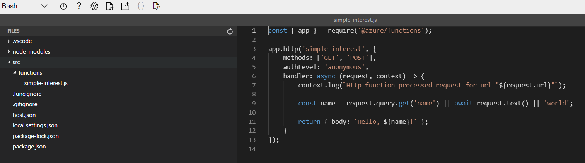

# Develop, test, and publish Azure Functions by using Azure Functions Core Tools

* [Function run local](https://learn.microsoft.com/en-us/azure/azure-functions/functions-run-local?tabs=windows%2Cisolated-process%2Cnode-v4%2Cpython-v2%2Chttp-trigger%2Ccontainer-apps&pivots=programming-language-csharp)
## Introduction
* The Azure Functions Core Tools are CL utilities that let you develop and run functions locally, and then publish them to Azure.

* Car dealership franchise. The salespeople are always looking for ways to modernize their workflow. Build a set of applications backed by Azure Functions. The first service built loan interest calculation can be called over the web to run. 

##  Create and run Azure Functions locally by using the Core Tools
* Building a simple interest calculator, by developing it locally and not in the Azure portal's functions editor. 
* Use VS or VSC, but decide to use the Core Tools from the command line and a basic text editor.

* What are the Azure Functions Core Tools (AFCT)?
    1. The AFCT are a set of command-line tools that you can use to develop and test Azure Functions on your local computer.
    1. The Core Tools feature different kinds of functions-related capabilities, but their primary purpose is to:
        1. Generate the files and folders you need to develop functions on your local computer.
        1. Run your functions locally so you can test and debug them.
        1. Publish your functions to Azure.
    1. The Core Tools are packaged as a single command-line utility named func. If you run func from the command line without any other commands, it will display version information and a usage guide.
    1. 
    1. The Core Tools are standalone utilities, not an extension of a larger IDE or tool. You can accomplish the above tasks with nothing but the command line and the Core Tools. 
    
* Core Tools versions
    1. 2 different versions of the Core Tools: versions 1.x and 2.x. 
    1. Use the latest 2.x, as it offers the best support for most scenarios.

* Function apps and functions projects
    1. Every function published to Azure belongs to a function app, which is a collection of one or more functions that Azure publishes together into the same environment. 
        1. All of the functions in a function app share a common set of configuration values. 
        1. Build them all for the same language runtime. 
        1. A function app is an Azure resource that can be configured and managed independently.
    1. When you develop functions locally, you work within a functions project. 
        1. The project is a folder that contains the code and configuration files that define your functions. 
        1. A functions project on your computer is equivalent to a function app in Azure, and can contain multiple functions that use the same language runtime.
    1. To start developing locally on your computer, you need to create a functions project folder that's organized correctly.
        1. Every new function you add to the project requires additional code and a configuration. 
        1. They must be complete and correctly structured, or your functions won't run.
    1. With the Azure Functions Core Tools, generate function projects and functions from scratch.

* Create a new functions project, run func init on the command line.
    1. 
    1. func init will ask you which language runtime you'd like to use for the app and tailor the project folder's contents appropriately.
    1. When you create a new functions project, the files included in the project folder depend on the language runtime you select. 
    1. Regardless of the runtime you choose, the two most critical project files are always present:
        1. host.json - stores runtime configuration values, such as logging options, for the function app. The settings stored in this file are used both when running functions locally and in Azure.
        1. local.settings.json - stores configuration values that only apply to the function app when it's run locally with the Core Tools. This file contains two kinds of settings:
            1. Local runtime settings: Used to configure the local functions runtime itself.
            1. Custom application settings: You add and configure them based on your app's needs. All the functions in the app can access and use them.
    1. Functions projects that func init generates don't have any functions in them. Let's find out how to add one.

* Create a new function with func new
    1. Each individual function in a project requires code and a configuration to define its behavior. 
    1. Running func new in a functions project folder will create a new function and all the files you need to get started developing.
    1. 
    1. After asking you which kind of function trigger you want to use and what you'd like to name your function, func new will generate a complete, publish-ready starter implementation in your function project's chosen language. 
    1. The starter code illustrates how to use the type of trigger you selected and is there to help you get started quickly: just replace the body of the function with your own implementation, and you're ready to build, run, test, and publish.
    
* Run functions locally
    1. Functions aren't programs that can be run on their own: they must be hosted. 
    1. The function host is what powers everything outside of your function code: it loads the configuration, listens for triggers and HTTP requests, starts the worker process for the language your functions are written in, writes log output, and more. In Azure, function apps run the function host automatically when they start.
    1. use the Core Tools to run your own instance of the functions host and try out your functions locally before you publish them. 
    1. By running your functions before publishing them, you can make sure your configuration and code loads correctly and test out your functions by making real HTTP calls to them without the need for Azure resources.
    1. To start the functions host locally, run func start from a functions project folder. 
        1. At the end of the output, the Core Tools will display local URLs you can use to call each of your functions. 
        1. While the host is running, you can use any tools or libraries that make HTTP calls, like curl, to interact with your functions. The Core Tools will write any log output produced by the host to the terminal in real time.
    1. 

## Exercise - Create a function locally using Core Tools
* Azure Functions Core Tools lets you develop functions locally on your own computer by:
    1. Creating the files and folders necessary for a functions project.
    1. Providing a Functions host that runs locally from the root directory of your project.

* The Azure Cloud Shell comes with Core Tools, Azure CLI, and an editor you can use to write code. 

* Create a local Azure Functions project
    1. Azure Cloud Shell includes version 4.x of Azure Functions Core Tools. This version requires your Node.js version to be at least version ~18. 
    1. Install the Node Version Manager (NVM) tool & Restart the cloud shell.
        1. curl -o- https://raw.githubusercontent.com/nvm-sh/nvm/v0.39.1/install.sh | bash
    1. Install Restart, use ->  nvm install 18.14.0 ,  nvm use 18.14.0.
    1. Create directory ->  mkdir ~/loan-wizard, cd ~/loan-wizard
    1. Run func init to initialize the loan-wizard directory as a functions project folder. -> func init
        1. When prompted select : worker runtime node (3) & language JavaScript (1).
        1. The files created - host.json, local.settings.json, 
            1. package.json is a JavaScript-specific file that keeps track of any packages you install and use within your code.
            1. .gitignore and extensions.json are configuration files that can be used by the version control tool and VSC.

* Create an HTTP-triggered function
    1. create function -> func new
        1. When prompted select : template HTTP trigger (7), function name (simple-interest).
    1. Open the Cloud Shell editor by running the following command. -> code .
        1. New version Azure Function 4
            1. )
        1. Old Version Azure Function 3
            1. 
            1. New folder created (simple-interest) with 2 files index.js and function.json, both with default content. 
        
* Implement the simple-interest function
    1. The default function implementation that Core Tools in index.js - input (name) in the query string or the body and returns the string Hello, [name]. 
    1. index.js
        ```    
        module.exports = async function(context, req) {
        // Try to grab principal, rate, and term from the query string and
        // parse them as numbers
        const principal = parseFloat(req.query.principal);
        const rate = parseFloat(req.query.rate);
        const term = parseFloat(req.query.term);

        if ([principal, rate, term].some(isNaN)) {
            // If any empty or non-numeric values, return a 400 response with an
            // error message
            context.res = {
            status: 400,
            body: "Please supply principal, rate and term in the query string"
            };
        } else {
            // Otherwise set the response body to the product of the three values
            context.res = { body: principal * rate * term };
        }
        };
        ```
    1. Parameters (principal, rate, and term), and returns the simple interest calculation (principal * rate * term).
    1. Save & close :  Ctrl+S, Ctrl+Q.

* Run the function in Cloud Shell
    1. To run locally, <ins>func start</ins> to start the Functions runtime (func.exe) in a background process, can use the CL while it's running. 
    1. Start the Functions host silently in the background.->  func start &> ~/output.txt &
        1. ignore the output. The Functions host is writing output to ~/output.txt, continue to use the cmd line while it's running.
        1. Use the ps command to verify that the func process is running.
    1. view the output log.-> code ~/output.txt -> ctrl+Q
        1. get simple-interest url -> http://localhost:7071/api/simple-interest.
        1. Error, press Ctrl+C to stop the host, the contents of your index.js file are the same as the sample above.
        1. Error, install node 18.14.0
            1. System.Private.CoreLib: Exception while executing function: Functions.simple-interest. System.Private.CoreLib: Result: Failure
            1. Exception: undici_1.Request is not a constructor
            1. Stack: TypeError: undici_1.Request is not a constructor 
    1. Access url, use curl "http://localhost:7071/api/simple-interest" -w "\n"
        1. pass input http://localhost:7071/api/simple-interest?principal=5000&rate=.035&term=36
    1. Enter the following command to again view the output log. -> code ~/output.txt
        1. see a set of log entries, each starting with a timestamp for each time you called the function with curl, looking like this.
        ```
        For detailed output, run func with --verbose flag.
        [2021-12-11T17:32:54.334] Worker process started and initialized.
        [2021-12-11T17:32:59.183] Host lock lease acquired by instance ID '0000000000000000000000003460A792'.
        [2021-12-11T17:33:19.442] Executing 'Functions.simple-interest' (Reason='This function was programmatically called via the host APIs.', Id=c291fbd0-b0ca-4d9c-a66c-a22f4bb3064a)
        [2021-12-11T17:33:19.669] Executed 'Functions.simple-interest' (Succeeded, Id=c291fbd0-b0ca-4d9c-a66c-a22f4bb3064a, Duration=301ms)
        [2021-12-11T17:33:42.255] Executing 'Functions.simple-interest' (Reason='This function was programmatically called via the host APIs.', Id=4c885ed7-7863-46a6-a606-985d37a139e1)
        [2021-12-11T17:33:42.260] Executed 'Functions.simple-interest' (Succeeded, Id=4c885ed7-7863-46a6-a606-985d37a139e1, Duration=13ms)
        Application is shutting down...
        Close the editor by pressing Ctrl+Q.    
        ```
## Publish a function to Azure using Core Tools
* Create a function app
    1. Before use Core Tools to publish a project, need to create a function app. 
    1. Creating function apps is accomplished through Azure management tools, which include the Azure portal, Azure CLI, and Azure PowerShell. 

* Publish to Azure
    1. Publish a functions project to Azure, run func azure functionapp publish <app_name> from the functions project folder.    
        1. <app_name> is the name of the target function app in Azure, not the name of your project folder, which can be different.
        1. 
    1. Once the tools indicate that publishing is complete, your functions are up and running in Azure. 
    1. The final output from the Core Tools will show the functions that were published, including the invocation URL of each function.

* Things to know
    1. The Core Tools don't validate or test your functions code during publishing.
        1. Make sure to use func start to do some testing before you publish!
    1. When you publish, any functions already present in the target app are stopped and deleted before the contents of your project are deployed.
        1. You can't combine functions from multiple projects into one app by publishing them in this sequence: --
        1. All of the functions you want in the app must be in one project.
    1. Publishing to Azure doesn't create any kind of relationship between the local project and the target function app.
        1. You can publish a single functions project to multiple function apps.
        1. You can also republish a project to the same app repeatedly as you work on your code.
    1. The invocation URLs displayed after you publish may include a code parameter in the query string.
        1. You can see it in the screenshot above: ?code=4FowT1ywMNoxqa...
        1. By default, Core Tools configure HTTP functions with an authorization level of function.
        1. The authorization level requires callers to provide a secret key in the request headers or query string.
        1. Core Tools includes the key in the query string of the displayed URL for your convenience.

## Exercise - Publish a function to Azure using Core Tools
* update latest Azure CLI -> az upgrade
    1. Otherwise, will get error -> "(InvalidApiVersionParameter) The api-version '2023-01-01' is invalid. The supported versions are '2023-07-01,2023-07-01-preview,202"

* To create a function app in Azure, run the following commands in Azure Cloud Shell. 
    ```
    RESOURCEGROUP="[sandbox resource group]"
    STORAGEACCT=learnstorage$(openssl rand -hex 5)
    FUNCTIONAPP=learnfunctions$(openssl rand -hex 5)

    az storage account create \
    --resource-group "$RESOURCEGROUP" \
    --name "$STORAGEACCT" \
    --kind StorageV2 \
    --location centralus

    az functionapp create \
    --resource-group "$RESOURCEGROUP" \
    --name "$FUNCTIONAPP" \
    --storage-account "$STORAGEACCT" \
    --runtime node \
    --consumption-plan-location centralus \
    --functions-version 4
    ```
    1. Specify the group created for you by the sandbox.
    1. The storage account and function app names include $(openssl rand -hex 5), which generates a random five-character string, to ensure that the names meet the requirement of being globally unique.
    1. az storage account create - creates an Azure storage account that will be used by the function app. 
        1. A storage account is a separate Azure resource that needs to be created before the function app can be created.
    1. az functionapp create - creates the function app. Our new app uses the node (JavaScript) runtime, and runs on the serverless, pay-as-you-go consumption billing plan.

* Publish to Azure
    1. function app has been created in Azure, publish our project to it with the Core Tools.
    1. Run -> cd ~/loan-wizard, func azure functionapp publish "$FUNCTIONAPP" --force
        1. --force to the end of the command to update the function app version mismatch.
        1. Previous exercise, where temporarily hosted your function locally, function is now live on the web.

* Run the function
    1. Run to get the invoke URL: func azure functionapp list-functions "$FUNCTIONAPP" --show-keys
    1. Run url with dd &principal=5000&rate=.035&term=36