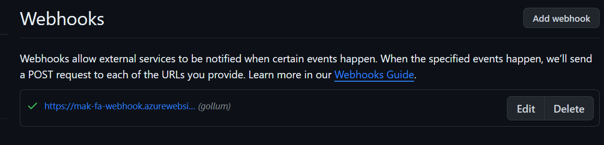
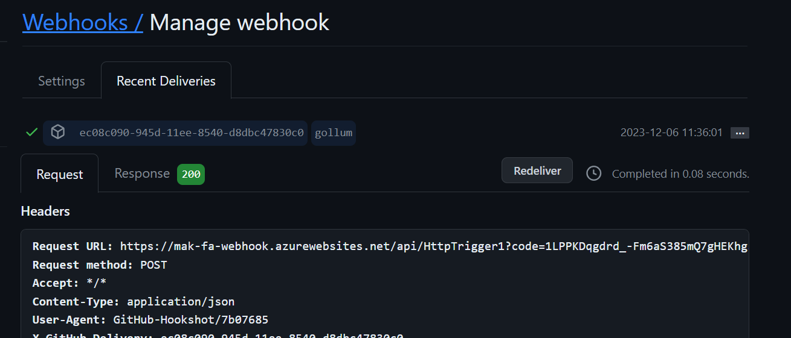

# Monitor GitHub events by using a webhook with Azure Functions

* Webhooks offer a lightweight mechanism for apps to be notified by another service when something of interest happens, by using an HTTP endpoint. 
* use a webhook to trigger an Azure function, and then analyze the message, to determine what happened and how to respond.

* Management wants a regular report on updates to the company's technology Wiki. 
    1. Like to know who contributes, how often it's updated and what pages are updated most often. 
    1. The Wiki is hosted on GitHub as a GitHub Wiki on one of the company's git repositories. 
    1. GitHub supports webhooks and can receive notifications for all kinds of events. 
    1. use a function as the listener for Wiki update events.

## Create a function that is triggered by a webhook
* What is a webhook?
    1. Webhooks are user-defined HTTP callbacks. 
    1. They're triggered by some event, such as pushing code to a repo or updating a wiki page. 
    1. When the event occurs, the source site makes an HTTP request to the URL configured for the webhook. 
    1. With Azure Functions, we can define logic in a function that runs when a webhook message is received.

    1. One common use of webhooks in a DevOps environment is to notify an Azure function that the code or configuration for an application has changed in GitHub. 
    1. The payload of the message sent through the webhook contains the details of the event. You can use the webhook with a function to perform a task such as deploying the updated version of the application.

## Exercise - Create an Azure function triggered by a webhook
* Create Function App resource
* Create Http Trigger

## Set up a webhook for a GitHub repository
* In GitHub, webhooks can be set up for an organization or for a specific repository. 
* A webhook is triggered each time one or more subscribed events occur. 
    1. For example, the Gollum event allows you to listen for wiki updates, in particular, the creation of and updates for a wiki page.

* Set up a webhook
    1. Setting up a webhook is a two-step process. 
        1. First, you specify in GitHub how you want your webhook to behave and which events it will listen to. 
        1. Second, you set up your function in Azure Functions to receive and manage the payload received from the webhook. 
        1. In the example scenario, we're setting up a webhook for a specific repository.

    1. To set up the webhook, GitHub portal -> Settings -> the name of your repository -> Webhooks -> Add webhook. 
        1. You can also build and manage a webhook through the Webhooks API, which is not covered in this module.
    
    1. Webhooks require a couple of configuration options before you can use them. We'll go through each of these settings next.

* Payload URL
    1. The payload URL is the URL of the server that will receive the webhook POST requests.
    1. Each event type has a specific payload format. That payload contains information about the event that triggered the webhook.

* Content type - Webhooks can be delivered using two different content types:
    1. The application/json content type delivers the JSON payload directly as the body of a POST request.
    1. The application/x-www-form-urlencoded content type sends the JSON payload as a form parameter, named payload.
 
* Events
    1. Events are at the center of webhooks. 
    1. Events occur whenever actions are taken in the repository. 
    1. When the event occurs, the webhook fires and calls the URL that you specify, sending along the payload and event information to your URL. 
        1. For example, to respond whenever an issue is raised in a repository, select Let me select individual events, and then select the Issues checkbox. 
    1. Make sure you select the Active checkbox to receive issue events for triggered webhooks. Then select Add webhook to activate the trigger.

    1. To listen for updates to the wiki for the repository, select the Wiki checkbox; this event is the Gollum event mentioned earlier. Select Add webhook to save all the individual events you selected.

    1. [A full list of webhook events, and when they can run, can be found by visiting GitHub Webhooks Events.](https://docs.github.com/en/webhooks#events

## Exercise - Set up a webhook for a GitHub repository

* Set up a webhook for a GitHub repository. Learn how to listen for specific events (in this case, the Gollum event), and how to make the webhook callback in your function when the event is triggered.

* Setup -> GitHub -> New repository (Public) -> Wiki -> Create the first page.
* Add a webhook for the Gollum event
    1. Gollum is the name of a GitHub event that is fired whenever a page in a repository's wiki is created or updated.
    1. Wiki Home page -> Settings -> Webhooks -> Add webhook -> Payload URL (Get Function URL), Content type (application/json),Which events would you...? (Let me select individual events -> Uncheck all, check only Wiki), Active (checked) -> Add webhook.
    1. Verify that your new webhook appears. It should have (gollum) at the end of its name.
        1. 

* Test the webhook
    1. GitHub -> Wiki -> Edit -> Enter text -> Save Page.
    1. Settings -> Webhooks -> Edit -> Webhooks/Manage -> Recent Deliveries -> Request (view Headers and Payload), Response (Headers, Body) messages
        1. 

## Trigger an Azure Function with a GitHub event
* The GitHub Gollum event enables you to listen for wiki updates. When this event occurs, your Azure HttpTrigger function is triggered, and you can parse the payload to retrieve and process the data that was sent.

* Gollum event payload
    1. pages that were updated. Each page includes the following information:
        1. page_name - Name of the page.
        1. title - Current page title.
        1. action - Action that was performed on the page - created or edited.
        1. html_url-  HTML wiki page.
    1. repository information about the repository containing the wiki page, including:
        1. name - Name of the repository.
        1. owner - Details of the owner of the repository.
        1. html_url - Address of the repository.
    1. sender information about the user that raised the event that caused the webhook to fire.
    1. For example, a payload might look like the following code.
        ```
        "pages": [
            {
                "page_name": "Home",
                "title": "Home",
                "summary": null,
                "action": "edited",
                "sha": "562362bc141b9e2db1fb971e1ecb4fd0b7457f68",
                "html_url": "https://github.com/testrepo/Hello-World/wiki/Home"
            }
        ],
        "repository": {
            ...
            "name": "testrepo",
            ...
            "owner": {
                ...
            },
            "html_url": "https://github.com/...",
            ...
        },
        "sender": {
            "login": "..."
            ...
        }
        ```
    1. This information is passed as the body of an HTTP POST request. We'll need to update our function logic to parse and process this information correctly.

* Parse information from the Gollum event
    1. Recall that the webhook runs when a specific event occurs. 
    1. The webhook then sends a request to the URL where your Azure Functions code is set up to listen, using the URL for your function. 
    1. The payload is passed to the Azure Function. Your function can parse the request body to extract the fields from the payload, and take the appropriate actions.
    1. The following example retrieves the repository name from the payload. The event type is available in the x-github-event request header. This data is output in the following function response.
        ```
        if (req.body.repository.name){
            context.res = {
                body: "Repository is: " + req.body.repository.name + ", Event Type is: " + req.headers['x-github-event']
            };
        }
        ```
    
## Exercise - Trigger an Azure Function with a GitHub event

* Update your function to parse information from the GitHub webhook payload, and display the results.
* Function App -> HttpTrigger1 -> index.js
    ```
    if (req.body.pages[0].title){
        context.res = {
            body: "Page is " + req.body.pages[0].title + ", Action is " + req.body.pages[0].action + ", Event Type is " + req.headers['x-github-event']
        };
    }
    else {
        context.res = {
            status: 400,
            body: ("Invalid payload for Wiki event")
        };
    }
    ```
    1. This code retrieves the event type from the request header, and the title and action fields from the message body. 
    1. This information indicates that page has changed, and whether it has been edited or newly created. 
    1. The code then constructs a response that summarizes the action. 
    
* Trigger your Azure Function with a Gollum event
    1. GitHub -> webhook -> Recent Deliveries -> Redeliver -> Yes -> Look New delivery Response ("Page is Home, Action is edited, Event Type is gollum")

## Secure Webhook payloads with a secret
* For security reasons, you might want to limit requests to those coming from GitHub. 
    1. opt to approve requests from GitHub's IP address. 
    1. An easier method is to set up a secret token and validate the request using this token.

* Webhook secrets
    1. Setting a webhook secret allows you to ensure that POST requests sent to the payload URL are from GitHub.
    1.  When you set a secret, you'll receive the x-hub-signature header in the webhook POST request.
   
* Validate payloads from GitHub
    1. When your secret token is set, GitHub uses it to create a hash signature for each payload. 
    1. This hash signature is passed along with each request in the headers as x-hub-signature.
    1. When your function receives a request, you need to compute the hash using your secret, and ensure that it matches the hash in the request header. 
    1. GitHub uses an HMAC SHA1 hex digest to compute the hash, so you must calculate your hash in this same way, using the key of your secret and your payload body. The hash signature starts with the text sha1=.

 ## Exercise - Secure webhook payloads with a secret
* index.js
    ```
    //add a reference to the crypto-js library
    const Crypto = require('crypto');

    module.exports = async function (context, req) {
        context.log('JavaScript HTTP trigger function processed a request.');
        // This code computes the hash of the key, using the same mechanism as GitHub.
        const hmac = Crypto.createHmac("sha1", "<default key>");
        const signature = hmac.update(JSON.stringify(req.body)).digest('hex');
        // prepends sha1= to the start of the key, so that it matches the format of x-hub-signature in the request header. 
        const shaSignature =  `sha1=${signature}`;
        const gitHubSignature = req.headers['x-hub-signature']; //retrieve the GitHub signature from the request header
        //Compare the two strings. If they match, process the request
        if (!shaSignature.localeCompare(gitHubSignature)) {
            if (req.body.pages[0].title) {
                context.res = {
                    body: "Page is " + req.body.pages[0].title + ", Action is " + req.body.pages[0].action + ", Event Type is " + req.headers['x-github-event']
                };
            }
            else {
                context.res = {
                    status: 400,
                    body: ("Invalid payload for Wiki event")
                }
            }
        }
        // If the strings don't match, return an HTTP 401 (Unauthorized) response, with a message "signatures don't match".
    else {
            context.res = {
                status: 401,
                body: "Signatures don't match"
            };
        }
    };
    ```
* Update the webhook secret -> webhook -> secret (<default key>) -> update -> Recent Deliveries -> Redeliver
    1. Response code is 200, the request was processed successfully with header "X-Hub-Signature: sha1=<hash of default key>"
    1. Change secret different -> Redeliver -> Response -> message "Signatures don't match" 